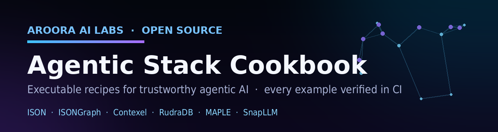

<p align="center">
  
</p>

<p align="center">
  <a href="https://github.com/maheshvaikri-code/agentic-stack-cookbook/actions/workflows/test.yml"></a>
  
  <a href="LICENSE"></a>
  <a href="CONTRIBUTING.md"></a>
  
</p>

<p align="center">
  <b>Executable recipes for building trustworthy agentic AI.<br>
  Every example runs in CI, offline, deterministically. If the badge is green, everything here ran today.</b>
</p>

---

Most LLM example repos show you code that *looked like* it worked the day it was written. This one makes a harder promise: **every recipe is executed on every push and every Monday**, with hard assertions on its own claims. A recipe that stops working turns the badge red for everyone to see.

One principle behind everything here: **AI systems should be verifiable, not just impressive.**

## ⚡ Quick start (30 seconds, no API key)

```bash
git clone https://github.com/maheshvaikri-code/agentic-stack-cookbook
cd agentic-stack-cookbook
pip install -r requirements.txt
python recipes/01_token_efficient_graphrag/pipeline.py
```

## 📖 Recipes

| # | Recipe | Scenario | Uses | Status |
|---|--------|----------|------|--------|
| 01 | [Token-efficient GraphRAG context](recipes/01_token_efficient_graphrag/) | retrieval output is noisy and over budget; shape it deterministically, encode it compactly | Contexel + ISONGraph | ✅ in CI |
| 02 | [Relationship-aware retrieval](recipes/02_relationship_aware_retrieval/) | similarity search returns lookalikes; follow graph edges to grounded evidence | RudraDB + ISONGraph | ✅ in CI |
| 03 | Deterministic context budgets | same agent, same inputs, byte-identical prompts across runs | Contexel | 🔜 planned |
| 04 | Multi-agent handoff | two agents exchange typed, validated messages instead of prose | MAPLE | 🔜 planned |
| 05 | Flat-data token diet | tool outputs as ISON instead of JSON, measured savings | ISON | 🔜 planned |
| 06 | Multi-repo agent context | feed several repos' code into one agent context within budget | Contexel + ISON | 🔜 planned |

Want a recipe that is not listed? [Open an issue](https://github.com/maheshvaikri-code/agentic-stack-cookbook/issues/new) describing the scenario, or better, [contribute it](CONTRIBUTING.md).

## 🔷 The stack

These recipes dogfood the open-source agentic stack built at [AroorA AI Labs](https://www.linkedin.com/in/maheshvaikri). Each tool does one job, and every recipe works with any subset; nothing requires the whole stack.

| Tool | Job | Install |
|---|---|---|
| [ISON](https://github.com/ISON-format/ison) | token-efficient format for flat data | `pip install ison-py` |
| [ISONGraph](https://github.com/isongraph/isongraph) | token-efficient property graphs for LLM context | `pip install ison-graph` |
| [Contexel](https://github.com/maheshvaikri-code/contexel) | deterministic context shaping: dedupe, relevance, token budgets | `pip install contexel` |
| [RudraDB](https://rudradb.com) | relationship-aware vector database | `pip install rudradb-opin` |
| [MAPLE](https://github.com/maheshvaikri-code/maple-oss) | multi-agent protocol engine with typed messages | `pip install maple-oss` |
| [SnapLLM](https://github.com/snapllm/snapllm) | multi-model serving, sub-ms switching | see repo |

## 📐 The contract

Every recipe follows the same four rules:

1. **Self-contained folder** with a README: problem, approach, run command, sample output.
2. **Runs offline by default.** No API key, no network, executable in seconds. Recipes that optionally call a model read `OPENAI_COMPATIBLE_URL` / `API_KEY` env vars and degrade gracefully without them.
3. **`--check` mode with hard assertions.** CI runs every recipe on every push and weekly, so dependency drift cannot rot the examples silently.
4. **Determinism is asserted, not assumed.** Where a recipe claims reproducible output, it runs twice and byte-compares.

Run the whole suite the way CI does:

```bash
for r in recipes/*/pipeline.py; do python "$r" --check; done
```

## 🤝 Contributing

Contributions are genuinely welcome, first-timers included. The bar is the contract above, not affiliation with this stack: recipes mixing these tools with LangChain, LlamaIndex, the plain OpenAI SDK, or anything else agentic are exactly what this repo is for.

- Read the short [CONTRIBUTING.md](CONTRIBUTING.md) (folder template included, ~5 minutes to your first PR)
- Good first contributions: any 🔜 recipe above, a new scenario from your own production pain, or a fix that turns the badge green again
- Every merged recipe credits its author in the recipe README and the table above

<p align="center">
  <a href="https://github.com/maheshvaikri-code/agentic-stack-cookbook/graphs/contributors">
    
  </a>
</p>

---

<p align="center">
  <sub>
    Part of the open agentic stack from <b>AroorA AI Labs</b> · built by <a href="https://www.linkedin.com/in/maheshvaikri">Mahesh Vaikri</a><br>
    <a href="https://github.com/ISON-format/ison">ISON</a> ·
    <a href="https://github.com/isongraph/isongraph">ISONGraph</a> ·
    <a href="https://github.com/maheshvaikri-code/contexel">Contexel</a> ·
    <a href="https://rudradb.com">RudraDB</a> ·
    <a href="https://github.com/maheshvaikri-code/maple-oss">MAPLE</a> ·
    <a href="https://github.com/snapllm/snapllm">SnapLLM</a><br><br>
    ⭐ If a recipe saved you tokens or a debugging afternoon, a star helps other builders find it.
  </sub>
</p>
